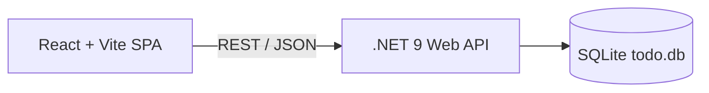

# Full-Stack Todo App: Vite + React + .NET 9 API

A modern full-stack **Todo** application built with:

- **.NET 9** Web API (C#)
- **React + Vite** frontend (SPA)
- **SQLite** persistence (`todo.db`)
- **Tailwind + shadcn/ui**-style components for a clean, modern UI
- **xUnit** + **EF Core InMemory** tests for the backend
- **Jest + React Testing Library** tests for the frontend

> Designed as a realistic, portfolio-quality sample for showcasing full-stack skills (API design, testing, modern frontend, and clean architecture).

---

## ✨ Features

- CRUD operations for Todos
- API versioning (`/api/v1/...`)
- Global error handling middleware
- EF Core + SQLite database
- Swagger/OpenAPI documentation
- Fully modern React SPA using Vite
- Component-based UI with clean structure
- Backend + frontend test suites (xUnit + Jest)
- Detailed API response models
- Environment configuration support
- CORS properly configured for local dev

---

## 🏗 Architecture Overview



---

## 📁 Project Structure

```text
TodoSolution/
├─ TodoSolution.sln
├─ src/
│  ├─ Backend.TodoApi/
│  │  ├─ Controllers/
│  │  │  └─ V1/
│  │  │     └─ TodoController.cs
│  │  ├─ Data/
│  │  │  └─ AppDbContext.cs
│  │  ├─ Dtos/
│  │  │  └─ V1/
│  │  ├─ Mappings/
│  │  ├─ Middleware/
│  │  │  └─ ErrorHandlingMiddleware.cs
│  │  ├─ Models/
│  │  │  └─ TodoItem.cs
│  │  ├─ Services/
│  │  │  ├─ ITodoService.cs
│  │  │  └─ TodoService.cs
│  │  ├─ Swagger/
│  │  ├─ Program.cs
│  │  ├─ appsettings.json
│  └─ Frontend.todo-app/
│     ├─ package.json
│     ├─ vite.config.js
│     ├─ jest.config.cjs
│     ├─ jest.setup.js
│     ├─ index.html
│     └─ src/
│        ├─ api/
│        │  └─ todoApi.js
│        ├─ components/
│        │  ├─ TaskInput.jsx
│        │  ├─ TaskItem.jsx
│        │  ├─ EmptyState.jsx
│        │  └─ __tests__/
│        ├─ globals.css
│        ├─ styles.css
│        └─ main.jsx
└─ tests/
   └─ Backend.TodoApi.Tests/
      ├─ Backend.TodoApi.Tests.csproj
      ├─ TodoServiceTests.cs
      └─ TodoControllerTests.cs
```

---

## 🔧 Tech Stack

### Backend
- .NET 9 Web API
- Entity Framework Core + SQLite
- API Versioning
- Swagger/OpenAPI
- xUnit test framework

### Frontend
- React + Vite
- Tailwind CSS
- Jest + React Testing Library
- JSDOM environment

---

## 🚀 Getting Started

### Prerequisites
- .NET 9 SDK
- Node.js 18+
- npm

Clone and enter the solution:

```bash
git clone <your-repo-url>
cd TodoSolution
```

---

# ⚙️ Backend (.NET 9 API)

### Install & Run

```bash
cd src/Backend.TodoApi
dotnet restore
dotnet run
```

API runs at:

- `https://localhost:7295`
- `http://localhost:5295`

### Swagger
Visit:

```
https://localhost:7295/swagger
```

---

## 🧪 Backend Tests (xUnit)

Run all backend tests:

```bash
cd tests/Backend.TodoApi.Tests
dotnet test
```

Uses EFCore InMemory provider + mock services.

---

# 🖥 Frontend (React + Vite)

### Install

```bash
cd src/Frontend.todo-app
npm install
```

### Run Dev Server

```bash
npm run dev
```

Runs at:

```
http://localhost:5173
```

### Environment Variables

Create `.env`:

```
VITE_API_URL=https://localhost:7295
```

---

## 🧪 Frontend Tests (Jest)

Run all tests:

```bash
npm test
```

Run with coverage:

```bash
npm test -- --coverage
```

---

# 📡 API Reference (v1)

Base URL:

```
https://localhost:7295/api/v1/todo
```

## 📘 Models

### TodoCreateDto
```json
{
  "title": "string",
  "description": "string (optional)",
  "dueDate": "2025-12-31T23:59:59Z"
}
```

### TodoUpdateDto
```json
{
  "title": "string",
  "description": "string",
  "isCompleted": true,
  "dueDate": "2025-12-31T23:59:59Z"
}
```

### TodoResponseDto
```json
{
  "id": 1,
  "title": "string",
  "description": "string or null",
  "isCompleted": false,
  "createdAt": "2025-11-24T10:01:23Z",
  "dueDate": "2025-12-31T23:59:59Z or null"
}
```

---

# 📑 Endpoints

## GET /api/v1/todo
Returns all todos.

## POST /api/v1/todo
Creates a new todo.

Example:
```http
POST /api/v1/todo
Content-Type: application/json

{
  "title": "Write README",
  "description": "Full instructions",
  "dueDate": "2025-12-01T18:00:00Z"
}
```

## PUT /api/v1/todo/{id}
Updates a todo.

## DELETE /api/v1/todo/{id}
Deletes a todo.

---

# 🔁 Dev Workflow

1. Run backend:
```bash
dotnet run
```

2. Run frontend:
```bash
npm run dev
```

3. Open:
- `http://localhost:5173`
- `https://localhost:7295/swagger`

4. Run tests:
```bash
dotnet test
npm test
```

---

# 📝 License
Add your preferred license (MIT recommended).
