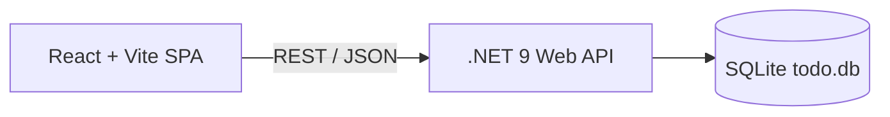

# Full-Stack Todo App: Vite + React + .NET 9 API

A modern full-stack **Todo** application built with:

- **.NET 9** Web API (C#)
- **React + Vite** frontend (SPA)
- **SQLite** persistence (`todo.db`)
- **Tailwind + shadcn/ui**-style components for a clean, modern UI
- **xUnit** + **EF Core InMemory** tests for the backend
- **Jest + React Testing Library** tests for the frontend

> Designed as a realistic, portfolio-quality sample for showcasing full-stack skills (API design, testing, modern frontend, and clean architecture).

---

## ✨ Features

---

## 📸 Application Screenshots

Below are two screenshots showcasing the modern design, clean UI, and the light/dark mode support.

### 🌅 Light Mode


### 🌙 Dark Mode


- CRUD operations for Todos
- API versioning (`/api/v1/...`)
- Global error handling middleware
- EF Core + SQLite database
- Swagger/OpenAPI documentation
- Fully modern React SPA using Vite
- Component-based UI with clean structure
- Backend + frontend test suites (xUnit + Jest)
- Detailed API response models
- Environment configuration support
- CORS properly configured for local dev

---

## 🏗 Architecture Overview



---

## 📁 Project Structure

```text
TodoSolution/
├─ TodoSolution.sln
├─ src/
│  ├─ Backend.TodoApi/
│  │  ├─ Controllers/
│  │  │  └─ V1/
│  │  │     └─ TodoController.cs
│  │  ├─ Data/
│  │  │  └─ AppDbContext.cs
│  │  ├─ Dtos/
│  │  │  └─ V1/
│  │  ├─ Mappings/
│  │  ├─ Middleware/
│  │  │  └─ ErrorHandlingMiddleware.cs
│  │  ├─ Models/
│  │  │  └─ TodoItem.cs
│  │  ├─ Services/
│  │  │  ├─ ITodoService.cs
│  │  │  └─ TodoService.cs
│  │  ├─ Swagger/
│  │  ├─ Program.cs
│  │  ├─ appsettings.json
│  └─ Frontend.todo-app/
│     ├─ package.json
│     ├─ vite.config.js
│     ├─ jest.config.cjs
│     ├─ jest.setup.js
│     ├─ index.html
│     └─ src/
│        ├─ api/
│        │  └─ todoApi.js
│        ├─ components/
│        │  ├─ TaskInput.jsx
│        │  ├─ TaskItem.jsx
│        │  ├─ EmptyState.jsx
│        │  └─ __tests__/
│        ├─ globals.css
│        ├─ styles.css
│        └─ main.jsx
└─ tests/
   └─ Backend.TodoApi.Tests/
      ├─ Backend.TodoApi.Tests.csproj
      ├─ TodoServiceTests.cs
      └─ TodoControllerTests.cs
```

---

## 🔧 Tech Stack

### Backend
- .NET 9 Web API
- Entity Framework Core + SQLite
- API Versioning
- Swagger/OpenAPI
- xUnit test framework

### Frontend
- React + Vite
- Tailwind CSS
- Jest + React Testing Library
- JSDOM environment

---

## 🚀 Getting Started

### Prerequisites
- .NET 9 SDK
- Node.js 18+
- npm

Clone and enter the solution:

```bash
git clone <your-repo-url>
cd TodoSolution
```

---

# ⚙️ Backend (.NET 9 API)

### Install & Run

```bash
cd src/Backend.TodoApi
dotnet restore
dotnet run
```

API runs at:

- `https://localhost:7295`
- `http://localhost:5295`

### Swagger
Visit:

```
https://localhost:7295/swagger
```

---

## 🧪 Backend Tests (xUnit)

Run all backend tests:

```bash
cd tests/Backend.TodoApi.Tests
dotnet test
```

Uses EFCore InMemory provider + mock services.

---


---

## ⚠️ PowerShell Execution Policy Fix (Before Running `npm install`)

If you see this error when running `npm install`:

```
npm.ps1 cannot be loaded because it is not digitally signed.
```

Windows PowerShell is blocking npm due to execution policy restrictions.

### ✅ Recommended Fix
Run PowerShell **as Administrator**:

```powershell
Set-ExecutionPolicy RemoteSigned -Scope CurrentUser
```

Press **Y** to confirm, then run:

```powershell
npm install
```

### ✅ Fix for Current Session Only
If you prefer not to modify your system policy:

```powershell
powershell -ExecutionPolicy Bypass
npm install
```

This allows npm to run safely for development setups.


# 🖥 Frontend (React + Vite)

### Install

```bash
cd src/Frontend.todo-app
npm install
```

### Run Dev Server

```bash
npm run dev
```

Runs at:

```
http://localhost:5173
```

### Environment Variables

Create `.env`:

```
VITE_API_URL=https://localhost:7295
```

---

## 🧪 Frontend Tests (Jest)

Run all tests:

```bash
npm test
```

Run with coverage:

```bash
npm test -- --coverage
```

---

# 📡 API Reference (v1)

Base URL:

```
https://localhost:7295/api/v1/todo
```

## 📘 Models

### TodoCreateDto
```json
{
  "title": "string",
  "description": "string (optional)",
  "dueDate": "2025-12-31T23:59:59Z"
}
```

### TodoUpdateDto
```json
{
  "title": "string",
  "description": "string",
  "isCompleted": true,
  "dueDate": "2025-12-31T23:59:59Z"
}
```

### TodoResponseDto
```json
{
  "id": 1,
  "title": "string",
  "description": "string or null",
  "isCompleted": false,
  "createdAt": "2025-11-24T10:01:23Z",
  "dueDate": "2025-12-31T23:59:59Z or null"
}
```

---

# 📑 Endpoints

## GET /api/v1/todo
Returns all todos.

## POST /api/v1/todo
Creates a new todo.

Example:
```http
POST /api/v1/todo
Content-Type: application/json

{
  "title": "Write README",
  "description": "Full instructions",
  "dueDate": "2025-12-01T18:00:00Z"
}
```

## PUT /api/v1/todo/{id}
Updates a todo.

## DELETE /api/v1/todo/{id}
Deletes a todo.

---

# 🔁 Dev Workflow

1. Run backend:
```bash
dotnet run
```

2. Run frontend:
```bash
npm run dev
```

3. Open:
- `http://localhost:5173`
- `https://localhost:7295/swagger`

4. Run tests:
```bash
dotnet test
npm test
```

---

## 📌 Next Steps / Extensions

Some natural extensions you could mention or implement:

- User authentication + multi-user task lists  
- Support for multiple Todo lists per user  
- Tagging, prioritization, and filtering  
- Pagination and search capabilities  
- Proper EF Core migrations instead of `EnsureCreated`  
- Docker Compose for API + SQLite + frontend  
- Add role-based access control (RBAC)  
- Replace SQLite with PostgreSQL or SQL Server  
- Add real-time updates using SignalR  
- Offline-first support with local storage sync  


---

# 🧠 Thought Process & Approach

This take‑home exercise was intentionally kept **small in scope**, but I approached it as if I were building a real, production‑bound feature.  
Below is an overview of my reasoning, assumptions, and guiding principles during development.

## 1. Keeping the Scope Clear & Manageable
Since the assignment did not include authentication, user identity, or multi‑tenant support, I deliberately kept the domain focused on a **single shared Todo list** with clean CRUD operations.  
This allowed me to prioritize architectural clarity over unnecessary complexity.

Where applicable, I still structured the API in a way that would make extending to multi-user or multi-list scenarios straightforward (e.g., layering services, mapping DTOs, and organizing controllers under versioned namespaces).

## 2. Clean, Well‑Structured Code
I followed these principles:

- Clear folder layout (`Controllers`, `Services`, `Dtos`, `Mappings`, `Middleware`, etc.)
- DTOs instead of exposing EF entities directly
- Services instead of putting logic in controllers
- A thin controller layer responsible only for request handling + routing
- Dependency Injection everywhere
- Consistent naming, formatting, and separation of concerns
- API Versioning (`/api/v1/...`) for future-proofing

This provides strong maintainability and clean entrance points for future functionality.

## 3. Thoughtful Architectural Decisions
Even though the assignment is small in scope, I included:

- **API Versioning** (production-ready consideration)
- **Global Error Handling Middleware**
- **DTO-to-Model mapping**
- **SQLite database** instead of InMemory for realistic persistence
- **Service layer for business logic**
- **Clean DTO contracts for API exchange**
- **Swagger/OpenAPI documentation**

All of these reflect real-world patterns used in production systems.

## 4. Good Communication Between Frontend & Backend
I placed specific emphasis on ensuring the frontend communicates cleanly with the API:

- A dedicated `todoApi.js` API client
- Centralized `request()` wrapper with JSON handling
- Proper CORS configuration on the backend
- Environment variable (`VITE_API_URL`) support for different environments
- Consistent request/response DTO shapes
- React components structured cleanly with predictable props + state

The goal was to mimic a real-world SPA communicating with a modern API.

## 5. Production‑Ready Considerations
Even in a small assignment, I incorporated real production habits:

- Versioned API
- Error middleware
- Logging considerations
- Separation of concerns
- Swagger docs for clarity
- SQLite for a realistic DB
- Architecture structured for scalability
- Testing both backend and frontend
- Clean setup requiring minimal assumptions

These align with what a real engineering team would expect from a foundational service.

## 6. Clear Documentation & Setup Instructions
The README includes:

- Step‑by‑step setup for backend & frontend
- Environment configuration
- How to run tests (backend & frontend)
- Project structure diagrams
- API documentation with models + examples
- Next steps for future extensibility
- Thought process (this section)

This ensures the reviewer can quickly run and evaluate the project.

## 7. Assumptions I Made
Because the instructions did not specify:

- No authentication → single anonymous user
- No multi-tenancy → one shared Todo list
- SQLite is acceptable for local development
- Design aesthetic left open → I created a modern Vite-based UI
- API contracts flexible → Defined consistent DTOs and responses

## 8. Why This Architecture Scales Well
If this were extended for real production use, the following changes would be straightforward:

- Adding authentication/authorization
- Supporting multiple Todo lists per user
- Adding real migrations + relational schemas
- Switching from SQLite to PostgreSQL
- Adding unit, integration, and e2e tests
- Deploying via Docker & CI/CD
- Adding caching or CQRS if needed

The separation of layers — API → DTOs → Service → Data — enables this flexibility.

---


---

## 💡 UI Enhancements Implemented During Development

### ⏳ Artificial Delay for Loading Indicator Demonstration
To demonstrate the loading indicator behavior on the frontend, an **artificial ~1 second delay** was added during the initial page load.  
This helps visually confirm that the loading state, spinner, and UI transitions all work as expected.

### 🌗 Light & Dark Mode Toggle
A **Light/Dark mode toggle** was implemented to allow users to switch themes dynamically.  
The UI fully supports theme-aware styling, ensuring consistent readability and aesthetics in both modes.


# 📄 License

This project is licensed under the **MIT License**.

```
MIT License

Copyright (c) 2025 <Your Name>

Permission is hereby granted, free of charge, to any person obtaining a copy
of this software and associated documentation files (the "Software"), to deal
in the Software without restriction, including without limitation the rights
to use, copy, modify, merge, publish, distribute, sublicense, and/or sell
copies of the Software, and to permit persons to whom the Software is
furnished to do so, subject to the following conditions:

The above copyright notice and this permission notice shall be included in all
copies or substantial portions of the Software.

THE SOFTWARE IS PROVIDED "AS IS", WITHOUT WARRANTY OF ANY KIND, EXPRESS OR
IMPLIED, INCLUDING BUT NOT LIMITED TO THE WARRANTIES OF MERCHANTABILITY,
FITNESS FOR A PARTICULAR PURPOSE AND NONINFRINGEMENT. IN NO EVENT SHALL THE
AUTHORS OR COPYRIGHT HOLDERS BE LIABLE FOR ANY CLAIM, DAMAGES OR OTHER
LIABILITY, WHETHER IN AN ACTION OF CONTRACT, TORT OR OTHERWISE, ARISING FROM,
OUT OF OR IN CONNECTION WITH THE SOFTWARE OR THE USE OR OTHER DEALINGS IN THE
SOFTWARE.
```
